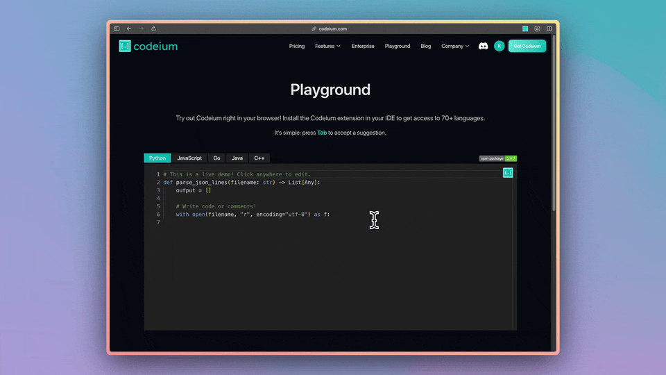

# Codeium Editor

CodeiumAI from Monaco Editor is a free, open-source code editor as a React component with unlimited AI autocomplete. Brought to you by the team at [Codeium](https://www.codeium.com/). **Free with no account required.**. All you need to do is install our NPM package, add it to your website and you're good to go!



## Features

- Unlimited AI autocomplete (no account required)
- Customizable API extended from [Monaco React](https://github.com/suren-atoyan/monaco-react?tab=readme-ov-file#editor)

## Demo

Check it out [here](https://codeium.com/playground)!

## Getting Started

Install using any of these package manager.s

```sh
# NPM
npm install monaco-editor-codeium-ai-plugin

# Yarn
yarn add monaco-editor-codeium-ai-plugin

# PNPM
pnpm install monaco-editor-codeium-ai-plugin
```

Now import the `CodeiumEditor` and enjoy lightning fast AI autocomplete, directly in your browser, 100% for free!

```ts
import CodeiumAI from 'monaco-editor-codeium-ai-plugin';
import * as monaco from 'monaco-editor';
const options = {
  language: 'javascript',
  theme: 'vs-dark',
  readOnly: that.readOnly,
  lineNumbers: type === 'javascript' ? 'on' : 'off',
  lineNumbersMinChars: 3,
  scrollBeyondLastLine: false,
  scrollbar: {
    verticalScrollbarSize: 5,
    horizontalScrollbarSize: 5,
  }
}
const editor = monaco.editor.create('containerId', options);
const codeiumAi = new CodeiumAI(editor, monaco);
codeiumAi.setOtherDocuments([]);
codeiumAi.update();

```

Note that the `otherDocuments` prop has a limit of 10 documents. Within those documents, Codeium will run a reranker behind the scenes to optimize what is included in the token limit.


## How it works

This project is a wrapper around Microsoft's Monaco editor which is the editor that powers VS Code with the extended capability of providing code autocompletion.

The autocompletes are provided by analyzing the editor's content and predicting and providing suggestions based on that context. To learn more about how the autocompletion works.
## What is Codeium

[Codeium](https://www.codeium.com?referrer=github) is a free, AI-powered developer toolkit that plugs into 70+ IDEs, including: Visual Studio Code, JetBrains IDEs, Google Colab, and Vim. Codeium provides unlimited AI context-aware autocomplete, chat assistant, intelligent search, codebase indexing, and more. Codeium also offers flexible deployments within your VPC or in on-prem, airgapped environments. Learn more at [codeium.com](https://www.codeium.com?referrer=github).

## License

[License](https://github.com/Exafunction/codeium-react-editor/blob/main/LICENSE)
